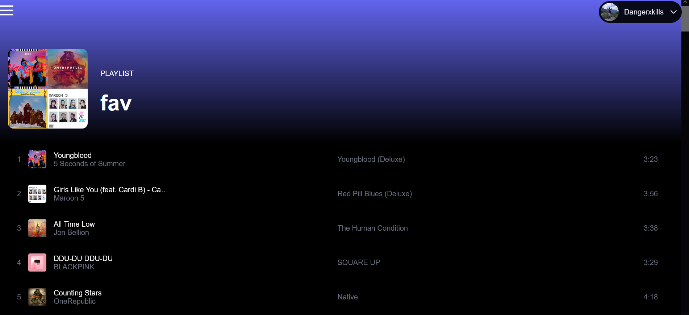

# Spotify Clone

A Spotify clone where user can login though their own spotify account and listen to music through their preferred devices

## API Reference

#### POST login usig spotify api

```http
  POST https://accounts.spotify.com/authorize?" + queryParamString.toString()
```

## Authors

-   [@jainChetan](https://thechetanjain.in)

## Color Reference

| Color            | Hex                                                              |
| ---------------- | ---------------------------------------------------------------- |
| Background Color |  #000000 |
| Text Color       |  #ffffff |

## Install

To install this project with npm or yarn.
Go to project directory

```bash
  git clone https://github.com/jainChetan81/Spotify-Clone.git
  cd Spotify Clone
```

then

```bash
  npm install || yarn install
  npm run dev || yarn dev
```

## Build

To build this project with npm or yarn.
Go to project directory

```bash
  npm run build || yarn build
```

To build this project with static pages without edge functions where Server Side Rendering won't work

```bash
  npm run build && npm run export || yarn dev && yarn export
```

## Tech Stack

**Client:** React, Recoil , next-pwa, tailwindcss, typescript, react-icons, next-auth

**Recoil**- for State managment\
**next-pwa** - for generating service worker\
**tailwindcss** - for utility based css framework\
**typescript** - type based language developed on top of javscript\
**react-icons** - for fontawesome icons to use in react\
**nex-auth** - for authentication in nextjs backend uing spotify web api\

## Project Structure

    --- ## atoms
    --- ## public
    --- ## component
    --- ## hoc
    --- ## hooks
    --- ## lib
    --- ## styles
    --- ## pages
    --- ## types

## Lessons Learned

-   I started this project to learn about Nextjs 12 features which are its middleware function and backend technology
-   Nextjs Server Side generation is used for reauthenticating whethere user is logged in or not

## Contributing

Contributions are always welcome!

See project structure

Please adhere to the Project Structure

## Feedback

If you have any feedback, please reach out to me at jain.cj.chetan@gmail.com

## 🚀 About Me

I am a Full Stack Web Developer with over two years of experience in various tech stacks.

## 🔗 Links

[](https://thechetanjain.in/)
[](https://thechetanjain.in/linkedin/)
[](https://thechetanjain.in/github)

## Screenshots



## Running Tests

To run tests with unit testing and end to end testing and finally a report, run the following command

```bash
  npm run test:jest
  npm run test:cypress
  test:mocha-report
```
